# CUB70 Standard CBM: complete figure-by-figure review

**Artifact reviewed:** the current executed `curated/notebooks/05_cub_cbm.ipynb` at commit `63134a5`, using the accepted official Koh Joint ResNet-50 CUB70 Standard seed-1 model. This review covers all 16 image outputs in that notebook. It does not use the old `minimal_cbm` CBM results.

## Direct answer: tail is not always the worst

The CUB70 result does **not** reproduce one simple FunnyBird ordering. Different measurements put different anatomical groups at the extremes:

| Measurement | Largest/worst group | Tail's value | What tail actually does |
|---|---:|---:|---|
| Positive label but mapped mask absent | neck `0.736` | `0.190` | third below neck, eye, and leg |
| Median concept classification error | eye `0.382` | `0.090` | worse than wing/beak/body/head, better than eye/leg |
| Median visible-minus-hidden raw score | wing `+1.572` | `+0.133` | weakest positive local-visibility association among groups with a value |
| Median hidden-positive minus hidden-negative raw score | neck `+14.574` | `+11.195` | second-largest contextual separation |
| Species-residual spread after concept and mask state are removed | head `4.161` | `3.856` | below head, wing, neck, and body |

So the defensible statement is narrower:

> In CUB70, tail is unusual because its score changes little with natural tail-mask visibility while remaining strongly separated by the label when the released tail mask is absent. It is **not** the worst group on data conflict, ordinary concept accuracy, or species residual variation.

This is a different dataset with different concepts, photographs, masks, and species. We should not expect the FunnyBird tail ranking to copy across automatically. CUB70 supplies observational warning signs, not a controlled tail swap.

## Quantities used throughout

For image `i` and exact concept `j`:

- `c_ij` is the processed yes/no concept label.
- `z_ij` is the saved CBM's raw concept score. Positive `z` means the model predicts the concept is present.
- `v_ig=1` means the released mask for anatomical group `g` occupies at least `0.001` of the image; `v_ig=0` means the released mask does not pass that threshold.
- **Positive-label/mask-absence rate:** `P(v=0 | c=1)`. This is a data/mask rate, not a model probability and not the fraction of labels missing.
- **Visibility effect:** `mean(z | c=1,v=1) - mean(z | c=1,v=0)`.
- **Context gap:** `mean(z | c=1,v=0) - mean(z | c=0,v=0)`.

The phrase “mask absent” must be read carefully. It can mean physical occlusion, a very small region, a coarse or missing released annotation, or a mismatch between the exact attribute and the coarse anatomical mask. It does not automatically mean the pixels are invisible to a person.

---

## Figure 1 · Population and mask coverage

**Question and prediction.** What data actually support the later visible-versus-hidden comparisons? There is no model prediction here. The goal is to expose coverage before interpreting scores.

**Inputs and method.** The figure joins the accepted 1,976-image CUB70 final-test prediction export to the released CUB masks. No classifier is trained and no model output is used. A mask is counted as visible when `mask pixels / image pixels >= 0.001`.

**How to read it.** Panel A is the fraction of 1,888 successfully mask-matched photographs where each of the 11 masks passes the threshold. Panel B is the median mask-area fraction. The join contains 67 of the 70 species and 107 of the 112 selected concepts.

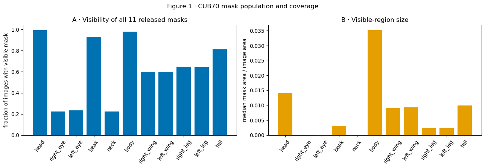

**Literal result.** Head and body masks are nearly always available (`0.9931` and `0.9783`). Beak is `0.9296`; tail is `0.8114`. Left/right wing are about `0.598`; left/right leg about `0.647`. Left/right eye are only `0.2346/0.2251`, and neck is `0.2230`. Median visible area is largest for body (`0.0351` of the image), followed by head (`0.0141`) and tail (`0.0099`); eye and neck medians are nearly zero.

**What it supports.** Mask evidence is highly uneven. Tail has substantially better mask coverage than eye or neck, so “tail is worst because its masks are usually absent” is already contradicted.

**Plausible alternative.** Low mask coverage can reflect annotation limitations rather than physical invisibility.

**Discriminating test.** Inspect actual photographs together with all masks, as Figure 12 does.

**Limited conclusion and next question.** The masks permit observational analysis but require coverage counts and visual auditing. Next ask whether the labels themselves make species shortcuts possible.

---

## Figure 2 · Species–concept structure before model behavior

**Question and prediction.** Are exact concepts unevenly tied to species? If so, species identity can predict a concept even before looking at model scores.

**Inputs and method.** Labels only; no model score and no trained diagnostic. For each of 112 exact concepts, the x-coordinate is the number of CUB70 species that carry it. Color represents positive photographs on a log scale. Dot size represents the number of alternatives in that attribute family. A grey outline marks concepts without a released-mask mapping.

**Concrete example.** `has_eye_color::black` appears in 63 of 70 species and 1,808 prediction images. `has_bill_color::buff` appears in one species and 30 images. Both are exact concepts, but they offer very different amounts of species discrimination.

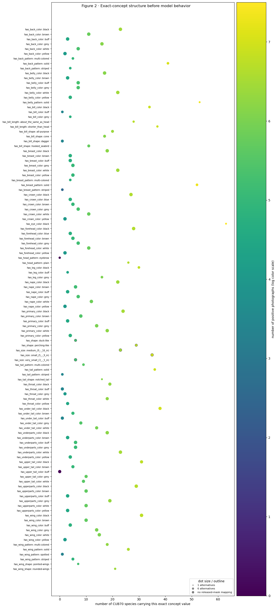

**Literal result.** Species support ranges from `0` to `63` of 70. Two selected concepts have zero positive images in this split: `has_head_pattern::eyebrow` and `has_upper_tail_color::buff`. Many rare values are carried by only one to five species, while common values are carried by dozens. Shape and size concepts have no matched released part mask.

**What it supports.** A contextual shortcut is available: many concepts are predictable from species membership or species-correlated appearance.

**Plausible alternative.** Availability is not use. A model can learn the named pixels even when species also predicts the label.

**Discriminating test.** Test whether species is recoverable from the learned raw scores and whether raw scores remain organized by species after label and mask state are controlled.

**Limited conclusion and next question.** The dataset permits context-based prediction, but this figure says nothing about whether the CBM uses it. Next quantify label/mask disagreement.

---

## Figure 3 · Positive label with no visible mapped mask

**Question and prediction.** How often does an image carry a positive exact-concept label while its mapped released mask does not pass the visibility threshold?

**Formula and denominator.** For concept `j`, the plotted rate is

`conflict_j = number of joined images with c_j=1 and v_g=0 / number of joined images with c_j=1`.

This is **not “unlabelled.”** The concept label is present and positive. What is absent is the released anatomical mask at the declared threshold.

**Inputs and method.** Labels and masks only. No model output and no new diagnostic. Every mask-testable exact concept is shown with its positive and mask-absent counts.

**Concrete example.** `has_tail_pattern::striped` has 30 positive joined images and 26 have no visible tail mask: `26/30=0.867`.

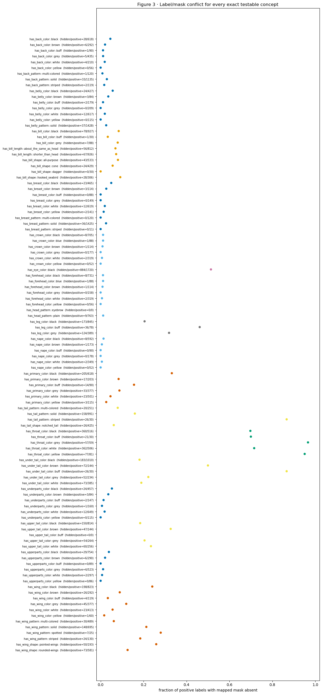

**Literal result.** The group-level rates are:

| CUB group | Hidden positive rows | Positive rows | Rate |
|---|---:|---:|---:|
| neck | 877 | 1,192 | `0.736` |
| eye | 884 | 1,720 | `0.514` |
| leg | 333 | 1,312 | `0.254` |
| tail | 947 | 4,978 | `0.190` |
| wing | 924 | 6,101 | `0.151` |
| beak | 304 | 4,081 | `0.074` |
| body | 319 | 12,917 | `0.025` |
| head | 44 | 5,118 | `0.009` |

The largest exact rates are throat grey `57/59=0.966`, throat yellow `77/81=0.951`, tail striped `26/30=0.867`, and under-tail buff `26/30=0.867`. Eye black is `884/1720=0.514`. Tail therefore contains severe exact values, but neck is much worse overall.

**What it supports.** Many labels can be learned without a released visible mask, especially for neck, eye, leg, and some tail values. This creates an incentive or opportunity for context use.

**Plausible alternative.** The released mask may be missing even when a human can see the region. A throat attribute mapped to a coarse neck mask is especially vulnerable to this mismatch.

**Discriminating test.** Inspect real images/masks and test whether hidden-positive scores remain separated from hidden-negative scores.

**Limited conclusion and next question.** This is a data-quality and mask-coverage warning, not proof of backwash. Next confirm the model outputs are usable.

---

## Figure 4 · Raw-score health

**Question and prediction.** Did the accepted CUB70 CBM learn varying, label-related concept outputs, or are some outputs constant?

**Quantities.** For each exact concept:

- `spread = Q95(z)-Q05(z)`;
- `label separation = median(z|c=1)-median(z|c=0)`;
- `balanced accuracy = (positive recall + negative recall)/2` using the saved decision `z>0`;
- `positive recall = P(z>0|c=1)`.

An output is exactly collapsed only when `spread <= 1e-8`.

**Inputs and method.** The accepted saved raw scores and labels for all 1,976 images and 112 concepts. No diagnostic is trained.

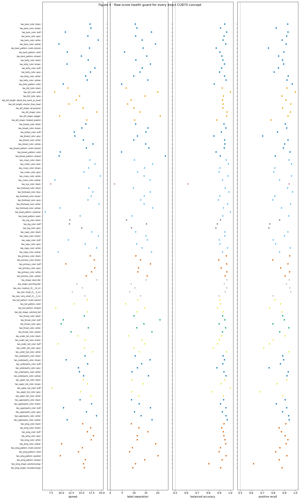

**Literal result.** Saved species accuracy is `0.7723`; mean concept accuracy is `0.9695`. The current official model has **zero exactly collapsed outputs** at tolerance `1e-8`. The two concepts with zero positive examples still have varying raw scores; zero positive support is not the same as collapse. At group level, median balanced accuracy is eye `0.618`, leg `0.882`, tail `0.910`, neck `0.930`, beak `0.934`, wing/head about `0.938`, and body `0.939`.

**What it supports.** The raw outputs are numerically usable. Ordinary exact-concept difficulty is concentrated most strongly in eye, not tail.

**Plausible alternative.** High overall bit accuracy can be inflated by many negatives; this is why balanced accuracy and raw-label separation are also shown.

**Discriminating test.** Continue with raw `z`, retain exact concepts rather than relying on the aggregate `0.9695`, and report low-support concepts separately.

**Limited conclusion and next question.** No output is exactly collapsed, but concept health is uneven. Next test how much species identity is present in the concept vector.

---

## Figure 4b · Species decoded from labels and raw concept scores

**Question and prediction.** Does the learned raw concept vector carry species information beyond the processed yes/no concept labels?

**Inputs and method.** Two new multinomial logistic-regression diagnostics are fitted after the CBM is frozen, using the same fixed 70/30 image split. Grey receives processed binary labels `c`; color receives raw scores `z`. The classifiers predict one of 70 species. The dashed line is blind chance `1/70=0.0143`; the dotted line is the saved CBM task accuracy `0.7723`. These diagnostics do not alter the CBM.

**Concrete example.** Tail labels alone identify species in `57.0%` of held-out images; tail raw scores identify species in `71.5%`. The extra `14.5` percentage points show that raw magnitudes contain species information not present in the yes/no tail labels.

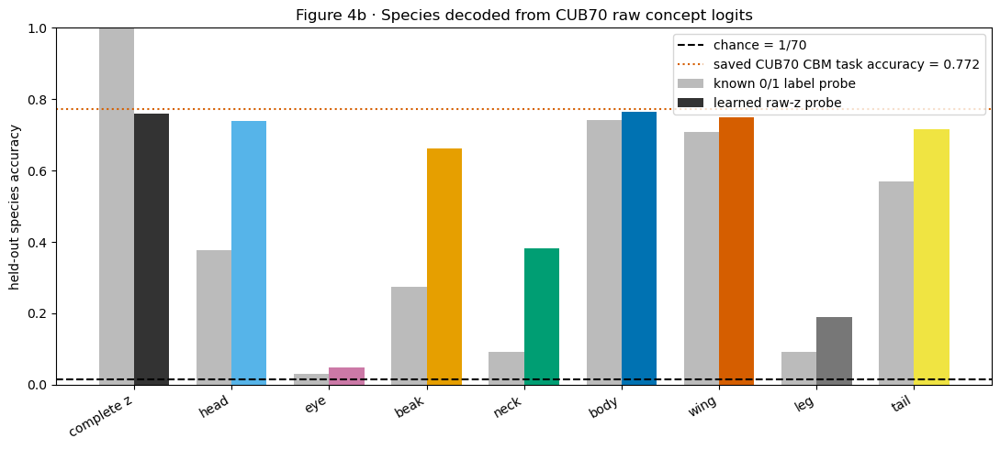

**Literal result.** Exact values are:

| Block | Coordinates | Labels → species | Raw `z` → species | Raw minus labels |
|---|---:|---:|---:|---:|
| all 112 | 112 | `1.000` | `0.761` | `-0.239` |
| head | 20 | `0.378` | `0.739` | `+0.361` |
| eye | 1 | `0.030` | `0.047` | `+0.017` |
| beak | 9 | `0.273` | `0.661` | `+0.388` |
| neck | 5 | `0.091` | `0.383` | `+0.292` |
| body | 37 | `0.742` | `0.766` | `+0.024` |
| wing | 18 | `0.708` | `0.750` | `+0.042` |
| leg | 3 | `0.091` | `0.191` | `+0.100` |
| tail | 14 | `0.570` | `0.715` | `+0.145` |

**What it supports.** Raw magnitudes carry extra species information in every block, especially beak, head, neck, and tail. Tail is not the largest raw-versus-label increase; beak and head are larger.

**Plausible alternative.** Species decoding measures information availability, not whether the saved class head uses it and not whether the concept is grounded in the named region. The complete binary label vector perfectly identifies species because CUB attributes are themselves highly species-specific.

**Discriminating test.** Compare species information with visibility, hidden context, and held-out species prediction. A true grounding test would still require a valid intervention.

**Limited conclusion and next question.** Species is strongly recoverable from the concept representation, but this cannot be called CUB backwash. Next ask whether natural visibility accompanies higher exact-concept scores.

---

## Figure 5 · Natural visibility effect

**Question and prediction.** Among positive-labelled images, is the raw score higher when the mapped region is visible?

**Formula.** `visibility_effect_j = mean(z|c=1,v=1)-mean(z|c=1,v=0)`. Positive means visible images score higher. Negative means the visible group scores lower; it does not automatically mean inverse pixel use because the two groups contain different photographs.

**Inputs and exclusions.** The accepted CBM is reused; no diagnostic is trained. Each exact concept needs at least 10 visible positives and 10 mask-absent positives. This leaves 48 exact concepts.

**Concrete example.** For wing grey, `5.454-2.000=+3.454` raw-logit units. For upper-tail grey, `1.879-3.089=-1.211`.

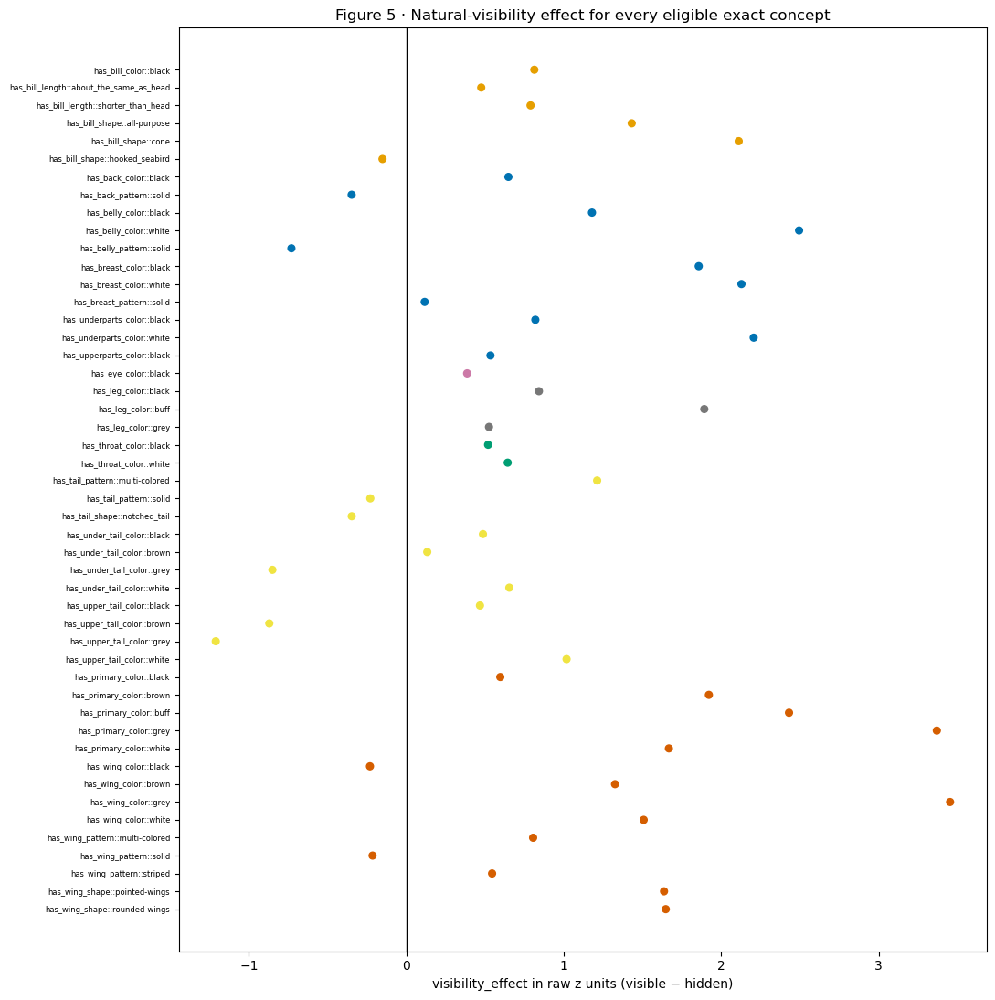

**Literal result.** Effects range from `-1.211` to `+3.454`. Median group effects are wing `+1.572`, leg `+0.842`, body `+0.819`, beak `+0.801`, neck `+0.582`, eye `+0.386`, and tail only `+0.133`. Tail contains positive cases such as tail multi-colored `+1.212` and negative cases such as upper-tail grey `-1.211`, upper-tail brown `-0.871`, and under-tail grey `-0.851`.

**What it supports.** Named-region visibility is associated with higher scores for many concepts. Tail has the weakest median association and the most conspicuous negative exact values among the displayed groups.

**Plausible alternative.** Species, pose, background, image quality, and mask quality differ between visible and mask-absent photographs.

**Discriminating test.** Examine bilateral/area dose response, species-conditioned held-out prediction, and real mask overlays.

**Limited conclusion and next question.** Tail shows weak natural local-visibility association, but natural photographs cannot establish a causal pixel response. Next ask whether labels remain separated when the mapped region is absent.

---

## Figure 6 · Hidden-region contextual separation

**Question and prediction.** When the mapped mask is absent, can the CBM still separate positive from negative labels?

**Formula.** `context_gap_j = mean(z|c=1,v=0)-mean(z|c=0,v=0)`. A value `+10` means hidden positive-labelled images average ten raw-logit units above hidden negative-labelled images.

**Inputs and exclusions.** Frozen CBM scores; no diagnostic. At least 10 hidden positives and 10 hidden negatives are required, leaving 50 exact concepts.

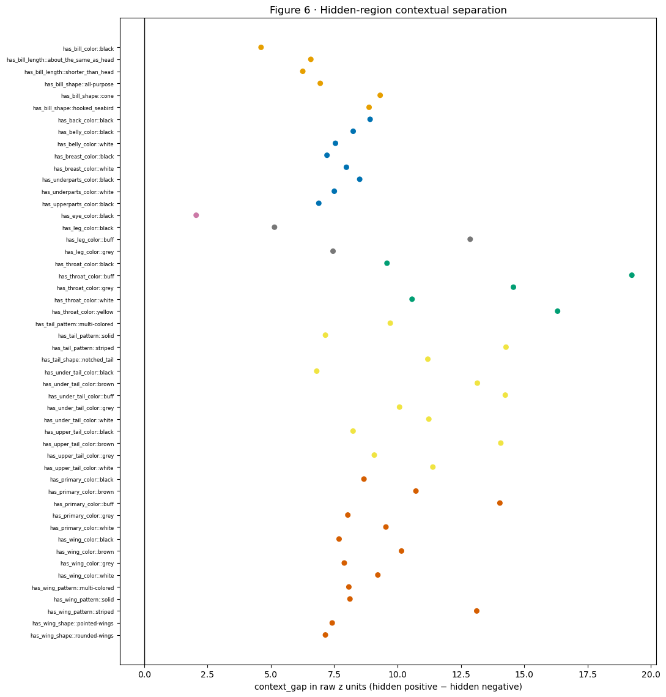

**Literal result.** All 50 eligible context gaps are positive. They range from eye black `+2.050` to throat buff `+19.250`. Group medians are neck `+14.574`, tail `+11.195`, wing `+8.398`, body `+7.765`, leg `+7.453`, beak `+6.763`, and eye `+2.050`.

**What it supports.** The CBM often predicts the label strongly even when the released mapped mask is absent. Tail is high, but neck is higher.

**Plausible alternative.** “Mask absent” is imperfect. The named pixels can remain visible without a released mask; species, pose, and background can also separate the groups.

**Discriminating test.** Inspect the masks and test whether species predicts held-out raw scores after exact concept and mask state are already known.

**Limited conclusion and next question.** This is strong observational evidence of context-organized concept scores, not a controlled donor/source event. Next test bilateral count and visible area.

---

## Figure 7 · Bilateral visibility and area dose response

**Question and prediction.** If local pixels matter, does the raw score rise when more of a bilateral region is visible or when the visible mask is larger?

**Quantities.** The left panel reports `mean(z|c=1, visible_sides=k)` for `k=0,1,2`. The right panel reports `mean(z in largest visible-area quartile)-mean(z in smallest quartile)` separately for each exact concept.

**Inputs and method.** Frozen scores, positive labels, and masks. No diagnostic is trained. Eye, wing, and leg use left/right mask counts. The area comparison is within exact concept.

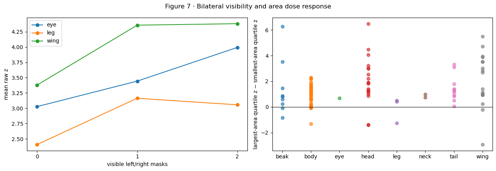

**Literal result.** Eye rises `3.027 → 3.443 → 3.993` as zero, one, then two eye masks are visible, although the two-mask group has only 14 rows. Wing rises `3.378 → 4.357 → 4.381`: one visible side matters, while the second adds little. Leg rises `2.407 → 3.163` then slips to `3.056`, so it is not monotone. Exact-concept area effects range from `-2.930` for pointed-wing shape to `+6.489` for nape buff; wing grey is `+3.536`, while several concepts are negative.

**What it supports.** Some local dose-response structure exists, most clearly for eye count and the first visible wing side. There is no universal monotone rule.

**Plausible alternative.** Area and visible-side count are tied to pose and species. A large mask can identify a photographic pose rather than supply more clean concept pixels.

**Discriminating test.** Predict held-out scores after holding exact concept and species fixed; inspect negative-area examples.

**Limited conclusion and next question.** Local evidence matters for some concepts, but it does not fully explain the hidden-context gaps. Next test species-dependent performance.

---

## Figure 8 · Species-matched concept differences

**Question and prediction.** After equalizing positive and negative sample counts for the same exact concept, does the saved concept output behave differently across species?

**Method.** For every exact concept, pair species that each have at least three positive and three negative images. Match both counts and resample. No classifier is trained. Panel A is the absolute difference in the CBM's own positive recall. Panel B is the absolute balanced-accuracy difference. Panel C is the mean of the absolute positive-image and negative-image raw-score differences.

**Concrete example.** A recall gap of `0.30` means that, for the same exact concept and matched positive counts, the saved `z>0` output recognizes positives 30 percentage points more often in one species than the other.

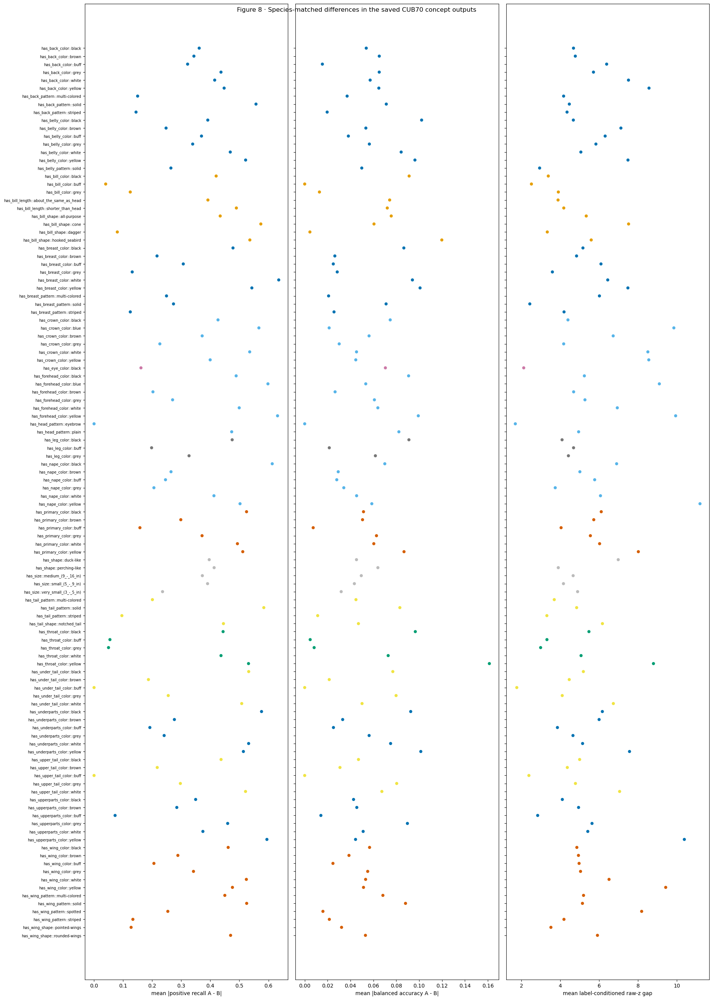

**Literal result.** The alignment audit covers all 112 concepts, 221,312 raw image-concept rows, and 5,190 eligible species pairs. Mean concept-level recall gaps range from `0` to `0.635`; individual matched-pair recall gaps reach `1.0`. Mean balanced-accuracy gaps reach about `0.161`, and label-conditioned raw-score gaps can exceed `20` logits in rare pairs. These differences occur across body, head, beak, wing, tail, neck, eye, and leg concepts.

**What it supports.** The same concept output behaves differently across species even after positive and negative counts are matched.

**Plausible alternative.** Species still bundle pose, habitat, image quality, annotation certainty, and background. Small matched counts can also produce extreme pair estimates.

**Discriminating test.** Use held-out image prediction with species and seed-level replication. Do not call recall gap a backwash measure unless it calibrates against FunnyBird controlled swaps.

**Limited conclusion and next question.** Species-dependent model behavior is real, but Appendix Figure A1 shows that the recall gap is not calibrated as a portable ranking of backwash. Next ask which measured dataset features organize visibility and context gaps.

---

## Figure 9 · Concept-level sequential prediction

**Question and prediction.** Can conflict, sample support, species support, or number of alternatives predict which exact concepts have large visibility effects or context gaps on held-out concepts?

**Method.** A new ridge-regression diagnostic is fitted with repeated five-fold cross-validation on the same 45 eligible exact concepts. The y-axis is prediction RMSE; lower is better. Predictors are standardized and added in sequence. This does not change the CBM and does not decompose causal percentages.

**Concrete example.** If RMSE falls from `2.45` to `1.37`, the added variables make unseen concepts' measured gaps more predictable. If RMSE rises, that addition receives no explanatory credit.

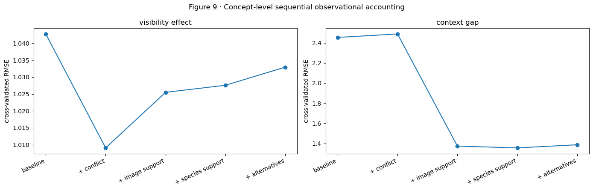

**Literal result.** For visibility effect, the intercept-only RMSE is `1.043`; conflict reduces it to `1.009`, but adding image support, species support, and alternatives worsens it to `1.025`, `1.028`, and `1.033`. For context gap, the intercept baseline is `2.454`; conflict alone is worse at `2.488`; adding image support sharply improves to `1.373`; species support gives a small further improvement to `1.355`; alternatives worsen it to `1.387`.

**What it supports.** Conflict weakly organizes natural visibility effects. Positive-image support and, slightly, species support organize context gaps. Number of alternatives adds no held-out value here.

**Plausible alternative.** Only 45 concepts are eligible, predictors are correlated, and the sequence assigns credit according to order. This is not a stable causal decomposition.

**Discriminating test.** Replicate with independent seeds or datasets and compare predeclared predictor orders/regularization.

**Limited conclusion and next question.** The measured factors predict some variation but do not fully explain it. Next remove exact concept and mask-state averages and inspect remaining species organization.

---

## Figure 10 · Species residual after exact concept and mask state

**Question and prediction.** Does species still organize `z` after the average for the same exact concept and visibility state is removed?

**Calculation.** For each row, compute `residual = z - mean(z for the same exact concept and v state)`. Then average residuals for each eligible concept/state/species cell with at least three images. A residual `+3` means that species averages three logits above the concept-and-mask-state mean.

**Inputs and method.** Frozen scores only; no classifier. Each panel sorts all eligible species cells for one anatomical group.

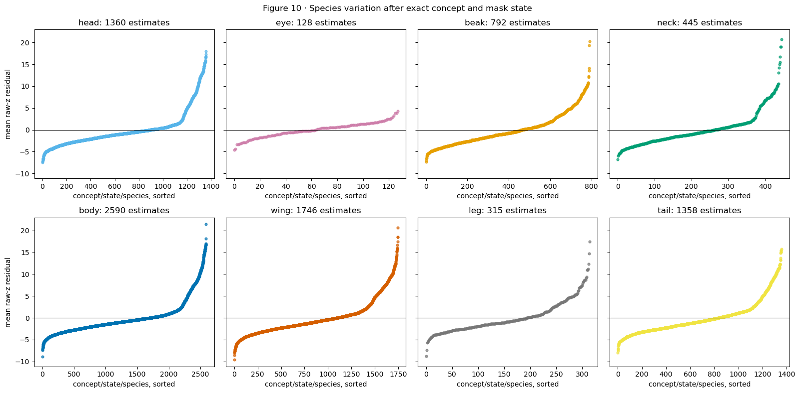

**Literal result.** Residual standard deviations are head `4.161`, wing `4.154`, neck `4.119`, body `3.995`, tail `3.856`, beak `3.821`, leg `3.676`, and eye `1.721`. Tail ranges from `-8.006` to `+15.727`, but wing, head, neck, and body have slightly larger overall spreads.

**What it supports.** Species organizes raw concept scores beyond exact concept identity and the current mask-state indicator.

**Plausible alternative.** Species is a bundle of pose, background, camera conditions, and annotation patterns. The residual is not a pure biological species fingerprint.

**Discriminating test.** Require species to improve prediction on held-out images, then eventually use a valid same-image intervention.

**Limited conclusion and next question.** Species-associated context is broad and not tail-specific. Next test whether it generalizes to held-out rows.

---

## Figure 11 · Row-level held-out accounting

**Question and prediction.** How much of an unseen image's raw concept score can be predicted from exact concept alone, then visibility/area, then species?

**Method.** New fold-specific, shrunken group-mean prediction rules are learned on training folds and evaluated on held-out image folds. The same rows are used at all stages. The y-axis is RMSE in raw-logit units; lower is better. The diagnostic does not change the CBM.

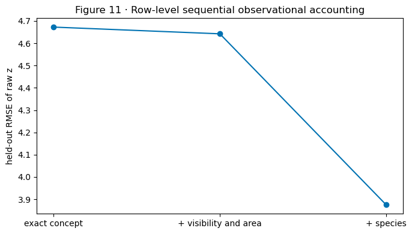

**Literal result.** Exact concept alone gives RMSE `4.672` and MAE `3.405`. Adding visibility and area changes RMSE only to `4.642` and MAE to `3.376`. Adding species lowers RMSE to `3.875` and MAE to `2.960`.

**What it supports.** Species supplies substantial generalizing predictive information beyond exact concept and the available mask variables. The mask variables add only a small amount in this model.

**Plausible alternative.** Species may stand in for unmeasured pose, background, habitat, or systematic mask quality rather than directly causing the concept score.

**Discriminating test.** A controlled same-image edit or a credible matched relabel/retrain is needed to separate these paths.

**Limited conclusion and next question.** Contextual organization generalizes across held-out images, but RMSE remains `3.875` and the cause is not identified. Next align every exact concept across all measurements.

---

## Figure 11a · Exact-concept synthesis

**Question and prediction.** Are coarse group results driven consistently by all exact concepts, or by a few difficult values?

**Inputs and method.** This figure aligns measurements already computed; it trains nothing new. Every row is one mask-testable exact concept. Panel A is mask-absence rate; B is `1-balanced accuracy`; C is visibility effect; D is context gap; E is species-residual standard deviation. Blank entries mean insufficient support, not zero.

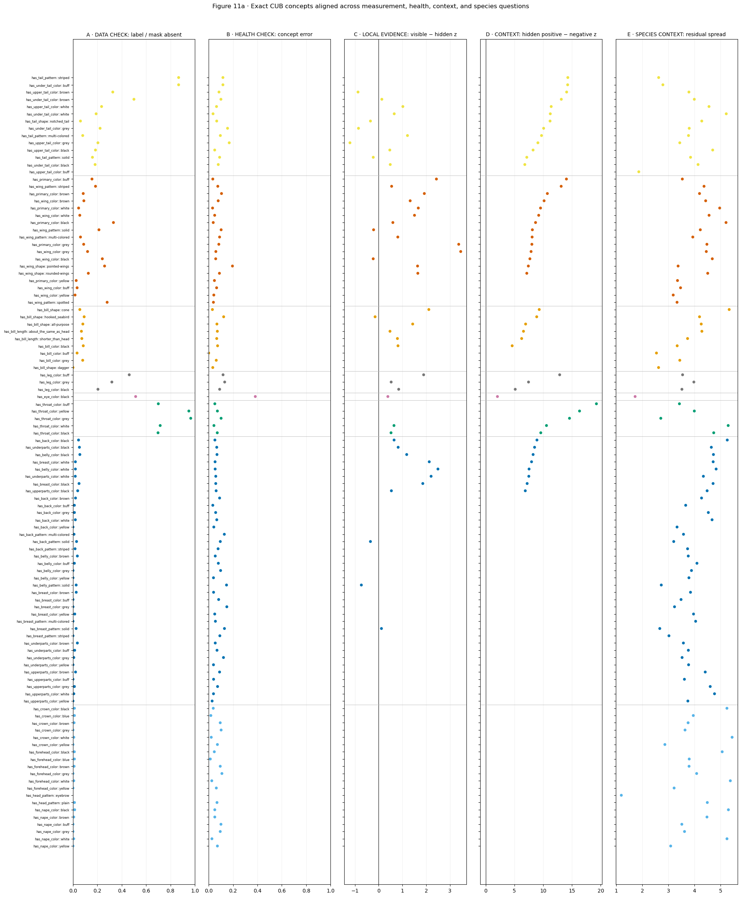

**Literal result.** The tail block is heterogeneous. Tail striped and under-tail buff each have mask-absence `0.867`, while tail shape notched has `0.061`. Upper-tail grey has a negative visibility effect `-1.211`; tail multi-colored has `+1.212`. Tail context gaps range from `6.810` to `14.282`. Wing also mixes negative and strongly positive visibility effects and has species-residual spreads up to `5.210`. Eye has the largest ordinary error (`0.382`) but the smallest context gap (`2.050`) and species spread (`1.721`). Neck has very high conflict and context gaps but ordinary error around `0.043–0.102`.

**What it supports.** There is no single “tail mechanism.” Exact label/mask disagreement, local visibility association, ordinary error, hidden context, and species organization separate from one another.

**Plausible alternative.** The apparent patterns can be driven by different eligibility counts and the coarse mapping of exact attributes to masks.

**Discriminating test.** Use the printed denominators and inspect exact concepts rather than treating group medians as universal.

**Limited conclusion and next question.** Tail contains several risky exact concepts, but other groups dominate other failure modes. Next summarize the group-level distribution without adding the quantities together.

---

## Figure 11b · Coarse anatomical synthesis

**Question and prediction.** Does one anatomical group repeatedly rank worst across all available CUB70 measurements?

**Method.** No new analysis model is fitted. The five panels aggregate earlier exact-concept measurements into the fixed order tail, wing, beak, leg, eye, neck, body, head. The panels use different units and must not be summed.

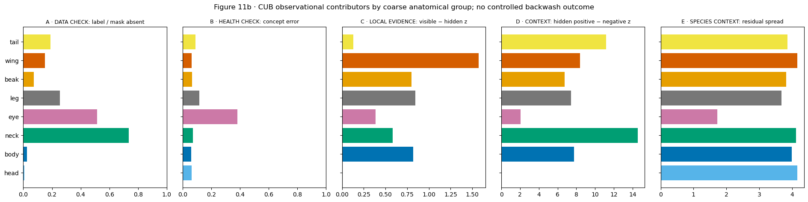

**Literal result.** The complete table is:

| Group | mask absent rate | classification error | visibility effect | context gap | species residual SD |
|---|---:|---:|---:|---:|---:|
| tail | `0.190` | `0.090` | `+0.133` | `+11.195` | `3.856` |
| wing | `0.151` | `0.062` | `+1.572` | `+8.398` | `4.154` |
| beak | `0.074` | `0.066` | `+0.801` | `+6.763` | `3.821` |
| leg | `0.254` | `0.118` | `+0.842` | `+7.453` | `3.676` |
| eye | `0.514` | `0.382` | `+0.386` | `+2.050` | `1.721` |
| neck | `0.736` | `0.070` | `+0.582` | `+14.574` | `4.119` |
| body | `0.025` | `0.061` | `+0.819` | `+7.765` | `3.995` |
| head | `0.009` | `0.062` | unavailable | unavailable | `4.161` |

**What it supports.** The rankings cross. Eye is hardest to classify. Neck has the most mask disagreement and largest hidden context gap. Wing has the strongest natural visibility association. Head, wing, and neck have the largest species residual spreads. Tail combines a weak visibility association with a high context gap, but it is not universally worst.

**Plausible alternative.** Group medians hide exact-value differences and use different eligible concepts.

**Discriminating test.** Return to Figure 11a and its denominators whenever a group-level bar is interpreted.

**Limited conclusion and next question.** CUB70 does not support a single tail-to-wing backwash ordering. It supports multiple observational warning modes distributed across anatomy. Next inspect actual images behind selected extremes.

---

## Figure 12 · Rule-selected photographs and mask overlays

**Question and prediction.** Do numerical extremes look like physical occlusion, missing/coarse annotation, pose differences, or plausible local evidence?

**Method.** No case was hand-picked for appearance. Four rules select one exact concept each: high conflict/high context, high conflict/low context, strong positive visibility effect, and negative visibility effect. For each concept, one mask-absent positive and one mask-visible positive are shown. Columns contain the photograph, the mapped mask, and all available masks.

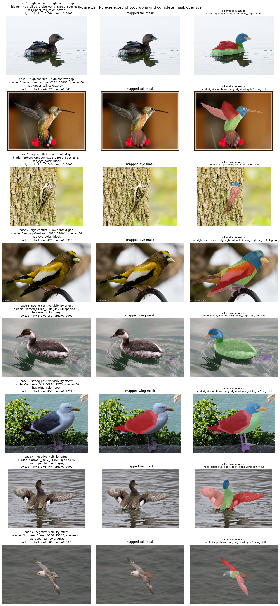

**Literal result.** Case 1, upper-tail brown, has conflict `0.326` and context gap `14.076`; the hidden grebe's tail is plausibly submerged/occluded, while the visible hummingbird has a tail mask. Case 2, eye black, has conflict `0.514` but context gap only `2.050`; the eye can be visually present while the released eye mask is tiny or absent. Case 3, wing grey, has visibility effect `+3.454`; the visible gull has a large wing mask and `z=5.451`, compared with `z=2.051` for the mask-absent grebe. Case 4, upper-tail grey, has a negative visibility effect `-1.211`; the mask-absent Gadwall scores `3.464`, while the visible fulmar scores `1.881`.

**What it supports.** The mask variable mixes true occlusion with annotation resolution and pose. Some strong positive visibility effects look locally plausible; negative effects can be produced by cross-species natural-image differences.

**Plausible alternative.** Two example images cannot establish a population mechanism, and the visible and hidden images are different species.

**Discriminating test.** Audit more rule-selected examples and, for causal claims, develop an edit that passes a known FunnyBird control before using it on CUB.

**Limited conclusion and next question.** The images justify conservative “released-mask absent” language. They do not justify calling every absent mask a physically hidden part.

---

## Appendix Figure A1 · Did the ordinary-image recall gap calibrate against known FunnyBird backwash?

### What succeeded and what failed

The statement “calibration failed on FunnyBird” does **not** mean the swap or recall computation failed.

1. The accepted FunnyBird renderer swap succeeded and produced all 5,000 rows.
2. The ordinary-image recall-gap calculation succeeded on the accepted 500-image Standard-CBM export. It reused the CBM's own `z>0` decision; no new classifier was trained.
3. The proposed relationship failed: concepts with a larger ordinary-image recall gap were not consistently the concepts with a larger controlled swap event rate.

**Recall-gap formula.** For two species `A` and `B` that both carry exact concept `j`,

`recall_gap_jAB = |P(z_j>0 | c_j=1,A) - P(z_j>0 | c_j=1,B)|`.

The actual FunnyBird labels are constant within species, so the audit proved that the positive-and-negative matching branch has no estimand. The authoritative all-positive-species fallback was therefore used. It produced 832 species pairs across 26 exact concepts.

**Controlled answer key.** For swaps inserting exact value `j`,

`event_rate_j = mean(1[response_delta>0 and final_margin<0])`.

This means the inserted pixels moved the donor concept in the correct direction, but the old source value still ended higher.

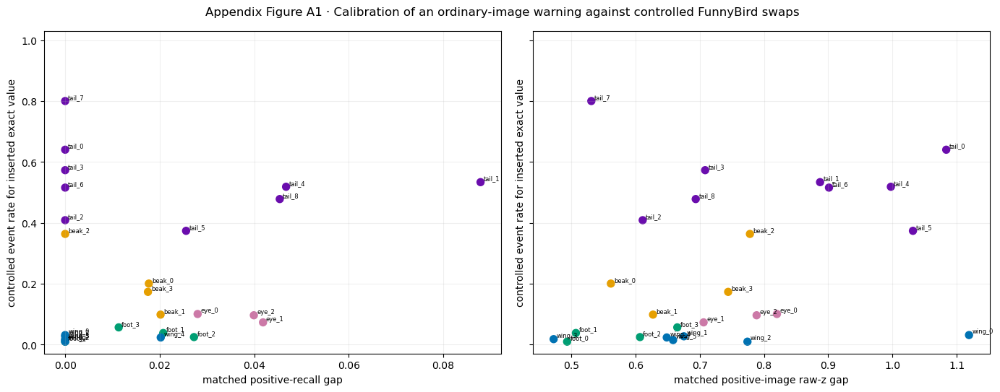

### Actual numerical evidence

| Check | Spearman rank correlation between recall gap and controlled event rate | Required result | Observed |
|---|---:|---|---|
| all 26 exact concepts | `+0.157` | positive | passes weakly |
| after subtracting each part's mean | `-0.369` | positive | **does not pass** |
| leave tail out | `+0.404` | positive | passes |
| leave wing out | `-0.169` | positive | **does not pass** |
| leave beak out | `+0.229` | positive | passes |
| leave foot out | `+0.122` | positive | passes |
| leave eye out | `+0.157` | positive | passes |

The predeclared rule required a positive overall relationship, a positive within-part relationship, and at least four of five positive leave-one-part-out checks. The result meets the first and third conditions but fails the within-part condition. The raw positive-image `z` gap has correlation `+0.404`, which is interesting but was not the recall proxy and does not repair the failed rule.

The full exact-value evidence is:

| Exact value | species pairs | recall gap | positive-image raw-`z` gap | controlled event rate |
|---|---:|---:|---:|---:|
| beak_0 | 50 | `0.018` | `0.562` | `0.200` |
| beak_1 | 45 | `0.020` | `0.627` | `0.098` |
| beak_2 | 15 | `0.000` | `0.778` | `0.363` |
| beak_3 | 50 | `0.018` | `0.744` | `0.173` |
| eye_0 | 50 | `0.028` | `0.820` | `0.100` |
| eye_1 | 50 | `0.042` | `0.706` | `0.072` |
| eye_2 | 50 | `0.040` | `0.788` | `0.096` |
| foot_0 | 50 | `0.000` | `0.493` | `0.009` |
| foot_1 | 45 | `0.021` | `0.507` | `0.038` |
| foot_2 | 50 | `0.027` | `0.607` | `0.024` |
| foot_3 | 50 | `0.011` | `0.665` | `0.056` |
| tail_0 | 6 | `0.000` | `1.084` | `0.640` |
| tail_1 | 10 | `0.088` | `0.887` | `0.533` |
| tail_2 | 21 | `0.000` | `0.611` | `0.408` |
| tail_3 | 21 | `0.000` | `0.708` | `0.573` |
| tail_4 | 6 | `0.047` | `0.997` | `0.518` |
| tail_5 | 28 | `0.026` | `1.032` | `0.373` |
| tail_6 | 10 | `0.000` | `0.901` | `0.515` |
| tail_7 | 1 | `0.000` | `0.531` | `0.800` |
| tail_8 | 28 | `0.045` | `0.694` | `0.478` |
| wing_0 | 10 | `0.000` | `1.119` | `0.031` |
| wing_1 | 36 | `0.000` | `0.675` | `0.027` |
| wing_2 | 50 | `0.000` | `0.774` | `0.009` |
| wing_3 | 10 | `0.000` | `0.472` | `0.017` |
| wing_4 | 45 | `0.020` | `0.649` | `0.023` |
| wing_5 | 45 | `0.000` | `0.658` | `0.014` |

**Concrete contradictions.** Tail_7 has recall gap `0.000` but controlled event rate `0.800`. Tail_0 has `0.000` versus `0.640`; tail_3 has `0.000` versus `0.573`; tail_6 has `0.000` versus `0.515`. These are not small deviations. They show that ordinary-image recall can look equal across species while controlled swaps still expose severe source retention.

**What the calibration supports.** Recall gap remains a model-health/species-dependence diagnostic. It is not calibrated to rank exact concepts by controlled backwash.

**Plausible alternative.** The overall positive correlation is mostly a between-part contrast: tail values tend to have high event rates while wing values have low event rates. Once each part's mean is removed, the association reverses. That is why the left panel visually looks somewhat positive even though the within-part test fails.

**Discriminating test.** Replicate the calibration across independent trained seeds. For MCBM, repeat it separately using each gamma checkpoint's own `z>0` outputs and its own 5,000 matched swap rows; historical feature probes do not answer this calibration question.

**Limited conclusion.** **METHOD NOT CALIBRATED AS A BACKWASH PROXY.** This rejects using ordinary recall gap to estimate or rank CUB70 backwash. It does not reject the FunnyBird swap result, the CUB70 model, or the broader hypothesis.

---

## Overall evidence chain

1. **The CUB70 data allow species shortcuts.** Exact concepts are unevenly distributed across species (Figure 2).
2. **Released masks are uneven and sometimes absent for positive labels.** This is strongest for neck and eye, not tail (Figures 1 and 3).
3. **The official model outputs are usable but uneven.** There are zero exact collapses; eye is the hardest coarse group (Figure 4).
4. **Raw concept scores carry species information.** Tail carries substantial information, but beak and head gain even more beyond labels (Figure 4b).
5. **Natural local visibility is associated with scores, but not uniformly.** Tail has the weakest median visibility association (Figures 5 and 7).
6. **Hidden positive and negative images remain strongly separated.** Neck is largest and tail second (Figure 6).
7. **Species differences remain after several controls and help predict held-out raw scores.** This is broad across groups, not tail-specific (Figures 8, 10, and 11).
8. **The measured factors do not form one additive explanation.** Their rankings cross, exact concepts disagree within a part, and natural photographs retain confounding (Figures 9, 11a, and 11b).
9. **Visual inspection confirms that mask absence mixes causes.** It can mean genuine occlusion, tiny/missing annotation, or pose/species differences (Figure 12).
10. **Ordinary recall cannot replace swaps.** It failed the within-part FunnyBird calibration against the known controlled outcome (Appendix Figure A1).

## Final conclusion

Accepted claim:

> The CUB70 Koh Joint model shows converging observational signs that exact-concept raw scores are organized by species/body context: species is decodable from `z`, hidden positive and negative images remain separated, species residuals remain after exact concept and mask state are centered, and species improves held-out raw-score prediction.

Not accepted:

> CUB70 tail has a measured controlled backwash rate, tail is always the worst part, or the measured associations establish that context rather than pixels caused the score.

The remaining scientific gap is intervention quality. FunnyBird's renderer gives a clean one-part counterfactual; CUB70 currently does not. The failed recall calibration shows why a convenient observational statistic cannot simply be renamed as a backwash proxy. A future CUB edit must first reproduce the known FunnyBird controlled result while preserving non-target pixels and producing a real donor response.
